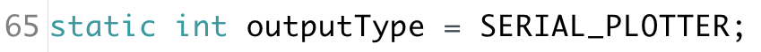
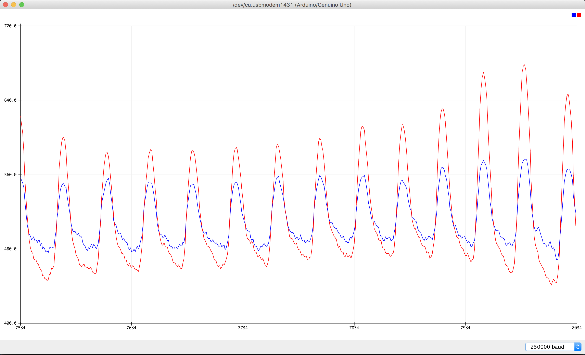
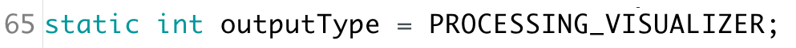
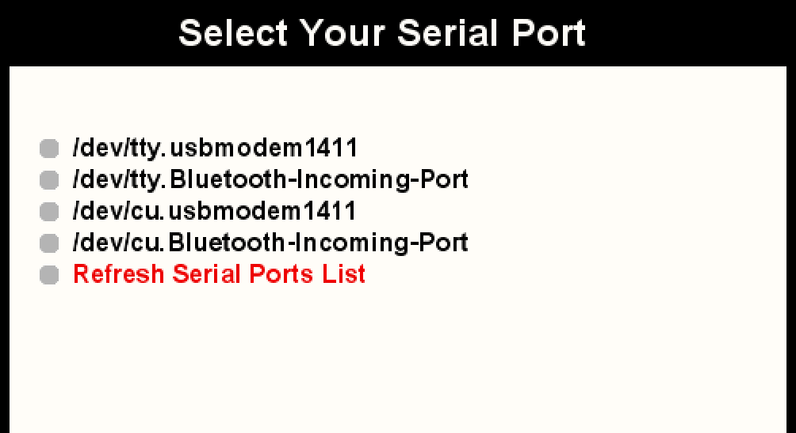
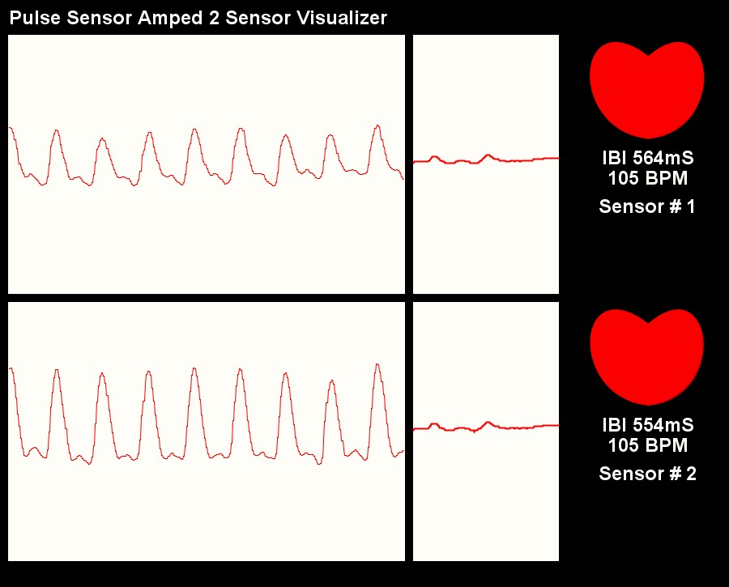

# 2 PulseSensor's on 1 Arduino
* Working Arduino code that uses 2 PulseSensor's at the same time !  
* Modifiable for more than two sensors 
* With Arduino UNO, you could potentially have up to 6 Pulse Sensors   
* Works with the Arduino Serial Plotter 
* Works with a modified version of our Processing Visualizer
* Blinks an LED with the pulse from each PulseSensor
* Fades an LED with the pulse from each PulseSensor 

This Arduino Sketch is written to target an Arduino UNO board. It can be modified to target other hardware. It will read the signal from 2 PulseSensor's on Analog pins A0 and A1.

**NOTE: For ease of implementation, this code is designed to power the PulseSensor's from Digital Pins 7 and 8. If you don't intend to power the PulseSensors from Digial Pins, you might want to take out that part.**

**IMPORTANT: Read this entire tutorial bifore getting started!**

## Connect To Arduino Serial Plotter:

You can visualize the PulseSensor data with the Arduino Serial Plotter.  
The first step is to download this repository. When the download is complete, move the file `PulseSensorAmped_2_Sensors_1.5.0` and all of it's contents into your `Documents/Arduino` folder.  
Next, connect the PulseSensors to your Arduino UNO like so:

* Connect Pulse Sensor **RED** wires to Digital Pins 7 and 8
* Connect Pulse Sensor **BLACK** wires to the GND Pins
* Connect Pulse Sensor **PURPLE** wires to Analog 0 and 1

Then, open the sketch called `PulseSensorAmped_2_Sensors_1.5.0` in Arduino and make sure that it is set up to send data to the Serial Plotter by ensuring that the variable `outputType` is set to `SERIAL_PLOTTER`. The variable is declaired on line 65:

Upload the sketch to your Arduino UNO, and then turn on the Serial Plotter by selecting `Tools > Serial Plotter` or using the shortcut `Command + L`. When it opens, make sure that the baud rate is set to `250000 baud` on the lower right menu. Here's an example of the data stream.

In this example, I am holding both of the Pulse Sensors against my right and left fingers. That's why the pulses are the same!

## Connect To PulseSensor Processing Visualzer:

You can visualize the PulseSensor data with a modified version of our Pulse Sensor Processing Visualizer, found in this repo.  
In order to view the data from two PulseSensor's with our modified Processing Visualizer, first download this repository. When the download is complete, move the file `PulseSensorAmped_2_Sensors_1.5.0` and all of it's contents into your `Documents/Arduino` folder. Then, move the file `PulseSensorAmpd_Processing_2_Sensors` and all of it's contents into your `Documents/Processing` folder. If you don't already have Processing on your computer, go to the [Processing website](http://www.processing.org) and download the latest version. Then come back here.  

Next, connect the PulseSensor's to your Arduino UNO like so:

* Connect Pulse Sensor **RED** wires to Digital Pins 7 and 8
* Connect Pulse Sensor **BLACK** wires to the GND Pins
* Connect Pulse Sensor **PURPLE** wires to Analog 0 and 1

Open the sketch called `PulseSensorAmped_2_Sensors_1.5.0` in Arduino and make sure that it is set up to send data to the Processing Visualzier by ensureing that the variable `outputType` is set to `PROCESSING_VISUALIZER`. The variable is declaired on line 65:

Upload the sketch to your Arduino UNO. Then, run the Processing app, and open the visualizer sketch by selecting `File > Sketchbook` and then choosing `PulseSensorAmped_Processing_2_Sensors`. You don't need to make any changes to this code. Simply run it by clicking the `Run` button on the top of the code window. When the program opens, it will prompt you to select the serial port your Arduino is connected to. This will be the same one that you used to program the board with Arduino.

The Visualizer will start running, and you should see two heartbeat data signals, along with the BMP [Beats Per Minute] and IBI [Interbeat Interval] data. The graphical hearts will 'beat' with your heartbeats! 

* Sensor # 1 is connected to Analog Pin `0`
* Sensor # 2 is connected to Analog Pin `1`.

In this example, I am holding both of the Pulse Sensors against my right and left fingers. That's why the pulses are the same! For more details on how our Visualizer works, please see this [README](https://github.com/WorldFamousElectronics/PulseSensor_Amped_Processing_Visualizer). 

## Attaching LEDs To Arduino UNO

The Arduino code supports a blinking LED and a fading LED for both PulseSensor's.

| Analog Pin  |  Blink Pin  |  Fade Pin  |
|:-----------:|:-----------:|:----------:|
|      0      |     13      |     5      |
|      1      |     12      |     9      |

**NOTE: Be sure to use a resistor in series with your LEDs!** 
